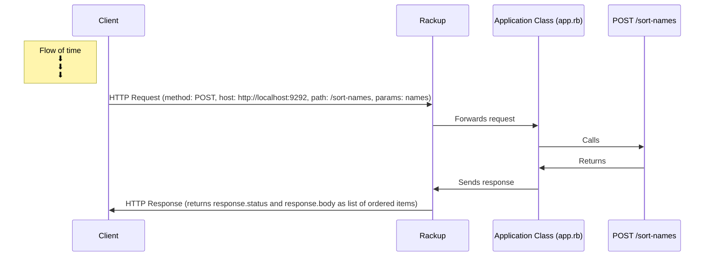

```mermaid

sequenceDiagram
    participant C as Client
    participant R as Rackup
    participant A as Application Class (app.rb)
    participant P as POST /sort-names 
    Note left of C: Flow of time <br />⬇ <br /> ⬇ <br /> ⬇ 
    C->>R: HTTP Request (method: POST, host: http://localhost:9292, path: /sort-names, params: names) 
    R->>A: Forwards request
    A->>P: Calls
    P->>A: Returns
    A->>R: Sends response
    R->>C: HTTP Response (returns response.status and response.body as list of ordered items)

```